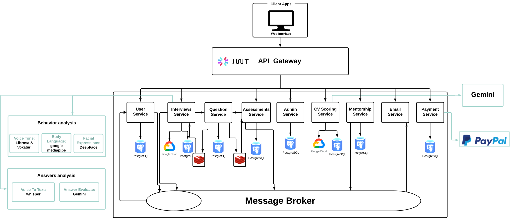

# CareerTkof – AI Job Preparation Platform  
### Graduation Project | 2024-2025  
**Faculty of Computers and Artificial Intelligence, Cairo University**  
Department of Information Systems

---

## Overview  
**CareerTkof** is an AI-powered job preparation platform designed to **bridge the gap** between academic learning and job market demands. It empowers **job seekers** to stand out in a competitive landscape by offering structured, effective, and accessible preparation tools that simulate real-world hiring experiences.

---

## Problem Statement  
Every year, millions of graduates enter the job market. Despite having the talent, many fail to secure interviews due to a lack of preparation, confidence, and guidance.  
- **75%** of CVs are rejected by Applicant Tracking Systems (ATS).  
- **39%** of candidates fail interviews because of anxiety and poor communication.  
The result is a widening gap between talented job seekers and available opportunities.

---

## Key Features  
- **AI-Powered Mock Interviews**  
  Simulated HR & technical interviews with AI-driven feedback (voice tone, body language, facial expressions, answers evaluation).  
- **Comprehensive Skill Assessments**  
  Job-specific MCQs and problem-solving tasks.  
- **CV Scoring & Optimization**  
  ATS-compliant scoring and job description matching.  
- **Expert Mentorship & Career Guidance**  
  Live mock interviews and coaching sessions.  
- **Performance Reports & AI Feedback**  
  Personalized insights and recommendations for improvement.  
---

## System Architecture  
CareerTkof is designed using a **microservices architecture** to ensure scalability, flexibility, and ease of maintenance. Each core functionality is implemented as an independent service, communicating through REST APIs and Message queue.

